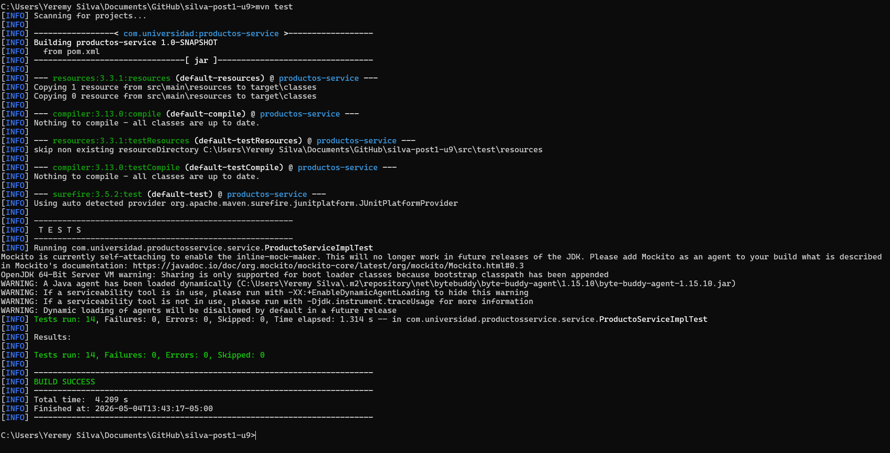

# productos-service

Servicio backend desarrollado con Spring Boot para la gestion de productos.

## Descripcion del proyecto

Este proyecto implementa una capa de negocio para productos con validaciones de entrada y pruebas unitarias usando JUnit 5 y Mockito.

La logica principal esta en `ProductoServiceImpl`, incluyendo reglas como:

- nombre obligatorio y no vacio
- precio mayor a cero
- stock no negativo
- normalizacion del nombre con `strip()` antes de persistir

## Tecnologias utilizadas

- Java 21
- Spring Boot 3.4.x
- Spring Data JPA
- H2 Database
- Lombok
- JUnit 5 + Mockito
- Maven

## Estructura principal

```text
src/
	main/java/com/universidad/productosservice/
		ProductosServiceApplication.java
		domain/Producto.java
		repository/ProductoRepository.java
		service/ProductoService.java
		service/ProductoServiceImpl.java
	test/java/com/universidad/productosservice/service/
		ProductoServiceImplTest.java
```

## Requisitos

- Java 21 instalado
- Maven 3.9 o superior

## Instrucciones de ejecucion

Desde la raiz del proyecto:

1. Compilar el proyecto

```bash
mvn clean compile
```

2. Ejecutar pruebas unitarias

```bash
mvn test
```

3. Generar artefacto

```bash
mvn clean package
```

3.1 Verificar pruebas y cobertura JaCoCo (umbral minimo 70% en la capa de negocio)

```bash
mvn clean verify
```

Reporte HTML de cobertura:

- `target/site/jacoco/index.html`

4. Ejecutar la aplicacion (opcional)

```bash
mvn spring-boot:run
```

## Evidencia de pruebas en verde (BUILD SUCCESS)

La siguiente captura corresponde al resultado exitoso de la ejecucion de `mvn test`:



## Commits descriptivos

Se recomienda mantener mensajes de commit claros y orientados a cambios funcionales, por ejemplo:

- `Implementa validaciones de negocio en ProductoServiceImpl`
- `Agrega pruebas parametrizadas para nombre y precio invalidos`
- `Anade pruebas con ArgumentCaptor para verificar normalizacion de nombre`
- `Documenta proyecto y evidencia de BUILD SUCCESS en README`
